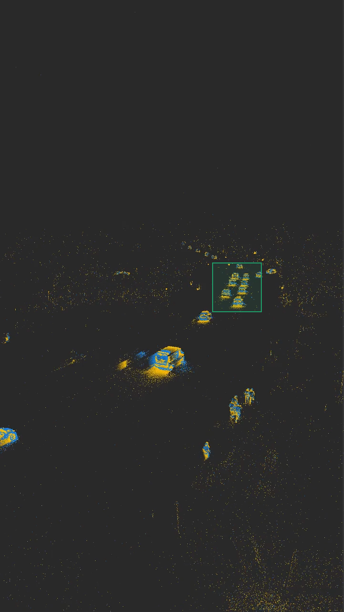

# 2Dto3D spike re-organization and transformation.


- [2Dto3D spike re-organization and transformation.](#2dto3d-spike-re-organization-and-transformation)
  - [Getting Started](#getting-started)
  - [Event camera](#event-camera)
    - [Dependencies and data](#dependencies-and-data)
    - [Generate a raster plot from camera events](#generate-a-raster-plot-from-camera-events)
    - [Shuffle pixels and generate a raster plot](#shuffle-pixels-and-generate-a-raster-plot)
    - [Render a video from an event stream](#render-a-video-from-an-event-stream)
      - [Install command_line_tools](#install-command_line_tools)
      - [Render an Event Stream as an .mp4 video](#render-an-event-stream-as-an-mp4-video)

This is code does not do anything useful yet, its a collection of loosely related large scale spike train analysis techinques applied in Julia and Python.

The original intention was to apply existing dimensionality reduction techniques to reduce the size of >1million cell spike trains down to something useful. The code here does not do that yet, and may not do it ever.

Others goals of this repository:

-   1 compute the Kreutz spike distance.
-   **2 Map 2D spike events (biological spike raster plots) to 3D raster plots that look like 3D event based camera spike events.**

## Getting Started

```
julia
```

At the prompt hit ] to enter julia's package mode:

```
] add https://github.com/lindermanlab/PPSeq.jl
```

This is short hand for

```
using Pkg
Pkg.add(url="https://github.com/lindermanlab/PPSeq.jl")
```

All other missing packages can be installed in a similar manner
Most often missing packages are registered.

For example

```
] add Plots.jl
```

Installs the registered Julia package plots.

Ultimately this project will need a Project.toml file this is analogous to a
python requirements.txt file

```bash
cd julia
julia
```

```julia
include("read_spikes.jl")
```

## Problem Statement:
We want to transform 2D biological spike raster plots to 3D spiking event based timeseries much like what is seen from event based cameras. This would be useful for a number of reasons. The main reasons it would be useful to convert 2D spikes to 3D event streams, is because there is a superset of useful neuromorphic algorithms that expects spikes to be formatted as a 3D event stream.

The code task implied by this work involves reorganizing the positions of pre-synaptic cell identifiers and spreading them over rows and columns in a pixel fashion.

The task may be a bit anologous to the current dipole problem in EEG, where unique volumetric activity maps such as voxels are inferred from what was sensed on the surface of the brain, in this way 2D signals are transformed onto a 3D space. 


## Classic Biological Spike Raster Plot.


<p align="center">
    
</p>

|
|
V
Apply Transformation
|
V


## Event camera

<p align="center">
    
</p>

The directory _event_camera_ contains code to read and process event-driven camera recordings. We use them here as a (coarse) analogue for biological spikes. Events are aready in 3D space (time, x, y) and can easily be converted to 2D space (time, index). We can use the latter as an exercise to test different 2D-to-3D algorithms with a known ground truth.

### Dependencies and data

```sh
cd event_camera
python3 -m pip install -r requirements.txt
wget https://cloudstor.aarnet.edu.au/plus/s/HIJS4rkeYrCS9Zf/download -O 2022-05-23T15-46-16-westmead.es
```

### Generate a raster plot from camera events

```sh
python3 crop.py 2022-05-23T15-46-16-westmead.es 446 629 100 100
python3 raster_plot.py 2022-05-23T15-46-16-westmead_cropped_left=446_bottom=629_width=100_height=100.es
```

### Shuffle pixels and generate a raster plot

```sh
python3 crop.py 2022-05-23T15-46-16-westmead.es 446 629 100 100
python3 shuffle.py 2022-05-23T15-46-16-westmead_cropped_left=446_bottom=629_width=100_height=100.es
python3 raster_plot.py 2022-05-23T15-46-16-westmead_cropped_left=446_bottom=629_width=100_height=100_shuffled.es
```

The files _...\_x_map.json_ and _...\_y_map.json_ describe the pixel shuffle operation. A pixel with coordinates `(x, y)` in the original stream has coordinates `(x_map[x], y_mapp[y])` in the shuffled stream.

### Render a video from an event stream

#### Install command_line_tools

```sh
git clone --recursive https://github.com/neuromorphic-paris/command_line_tools.git
cd command_line_tools
sudo apt install premake4 # macOS: brew install premake
premake4 gmake
cd build
make
cd ..
sudo apt install ffmpeg # macOS: brew install ffmpeg
```

#### Render an Event Stream as an .mp4 video

```sh
# from the command_line_tools directory
python3 render.py /path/to/input.es
```
