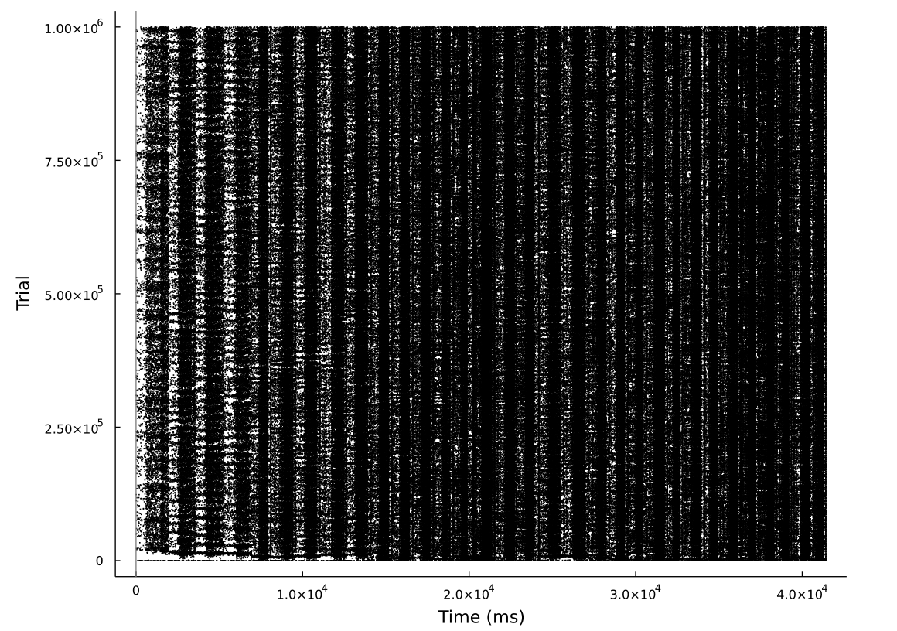

This is code does not do anything useful yet, its a collection of loosely related large scale spike train analysis techinques applied in Julia and Python.

The intention was to apply existing dimensionality reduction techniques to reduce the size of >1million cell spike trains down to something useful. The code here does not do that yet, and may not do it ever.

Others goals of this repository:
* 1 compute the Kreutz spike distance.
* 2 Map 2D spike events (biological spike raster plots) to 3D raster plots that look like 3D event based camera spike events.
